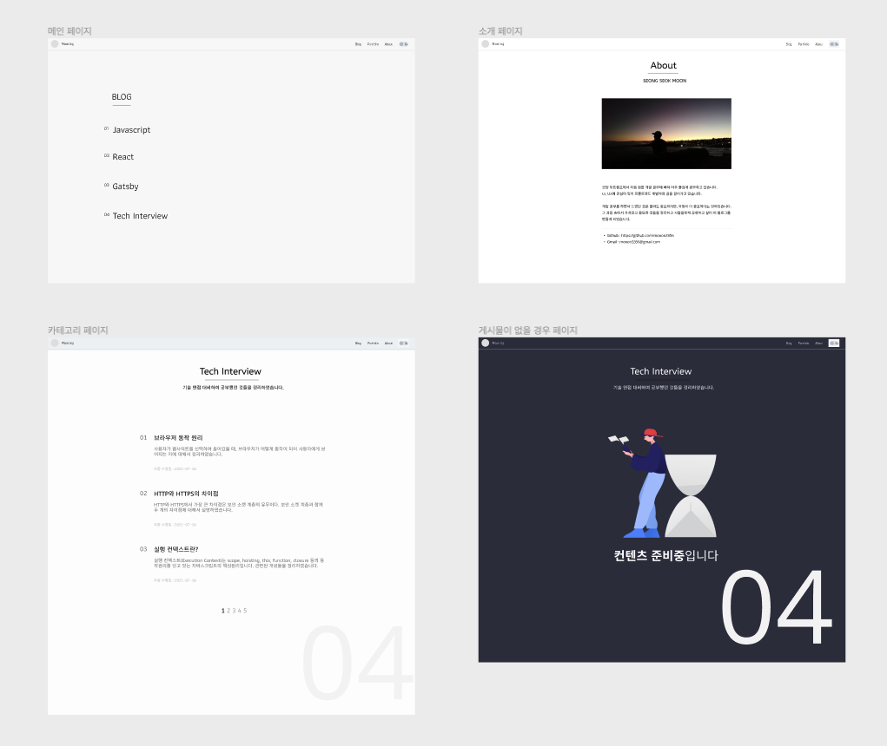

Gatsby를 활용하여 첫 개인 블로그를 만들었다 ! 벨로그도 굉장히 좋아해서 자주 이용하지만 일상 관련된 글들도 함께 포스팅 하고 싶기도 하고, 무엇보다 나만의 블로그를 만드는 과정이 너무 재밌을 것 같아서 기획에 들어가게 됐다.
  
# 기획

## 1) 개츠비를 사용한 이유

정적사이트를 생성하는데 도움을 주는 도구들로 지킬을 비롯한 휴고 등 많은 도구들이 있었다.
이 많은 도구들 가운데에서 개츠비를 사용한 이유는 다음과 같다.

- **React 기반**

  많은 사람들이 Jekyll을 사용하여 정적 페이지를 생성하고 있지만, ruby 기반으로 되어져 있어서 커스텀하는데 힘들다는 단점이 있다고 한다.
  리액트 개발에 익숙한 나에게 리액트 기반으로 되어져있는 Gatsby를 선택하지 않을 이유는 없었다.

- **깔끔한 문서화**

  많은 개발자들이 사용하고 있고, 커뮤니티가 활성화 되어있어서 막히는 부분들을 쉽게 참조할 수 있었다. 많은 템플릿 또한 공유되고 있어서 원한다면 마음에 드는 블로그를 빠르게 생성할 수 있다. 문서를 참고하면서 영어 공부도 추가로 할 수 있었어서 좋았다 !

- **다양한 플러그인**

  다양한 도구들을 사용할 수 있는 플러그인들이 정리가 잘되어 있어서 필요한 기능들을 쉽게 사용 가능하다.

## 2) 디자인

처음에는 개츠비 커뮤니티에 다양한 템플릿들이 있어서 그 중에 하나를 사용해볼까 했다. 그런데 처음이자 마지막이 될 수도 있는 내 개인 블로그인데다가, 기왕 만드는거 '바닥부터 제작해보자!' 라는 생각으로 개츠비에서 제공하는 기본 스타터만 사용하였다.  

### 그래서 디자인은 어떻게?

두 차례의 팀 프로젝트를 진행하면서 중요하다고 생각했던것 중 하나가, 초기 디자인 기획이었다.
나중에 디자인이 마음에 안들어서 전체적인 레이아웃을 갈아엎어야 되는 대참사가 발생하지 않게 Figma 툴을 사용하여 프로토타입을 작성하였다. ~~몇 년 뒤에도 마음에 들지는 모르겠다~~

### 사용한 CSS-in-JS Library

한동안 styled-components를 사용하여 스타일을 적용했었다. css를 js 안에서 적용시킬 수 있었던 점이 굉장히 마음에 들었었지만, 스타일을 꾸밀 태그들을 모두 컴포넌트로 바꾸는 면에서 가독성이 떨어진다고 생각을 했었다. 다른 방법의 스타일을 꾸밀 라이브러리를 생각하던 중, 문제점이었던 가독성을 해결할 수 있는 <u>**_emotion_**</u> 라이브러리를 알게되어 프로젝트에 적용시켰다. (Thanks to Y)
  

# 힘들었던 점
개츠비 공식 홈페이지에 문서들이 잘 정리되어 있어서 진행하면서 크게 어려웠던 점은 없었다. 다만, <u>**다크모드**</u>를 플러그인 없이 처음부터 구현하는 것에 있어서 조금 시행 착오가 있었고, 배포하는 과정에서 오류들이 있어서 조금 애를 먹었다. 관련해서는 따로 글을 포스팅할 예정이다.

최대한 빨리 블로그 틀만 구현을 하고 천천히 리팩토링 하자는 마음으로 시작을 했어서 아직 부족한 기능들이 많다. 기술 면접 준비하면서 리팩토링도 함께 진행해야 될 것 같다.
  

## 추가할 기능들
**1. 사이드바**
- 사용자가 게시물에 들어갔을 때, 다른 카테고리로 이동할 수 있는 기능 추가

**2. TOC (Table of Contents)**
- 글에 들어갔을 때, 자동으로 생성되는 목차 기능 추가

**3. utterances**
- 블로그 글에 댓글을 달 수 있는 기능 추가

**4. 모바일 반응형**
- 모바일 환경에서도 확인할 수 있게 구현

## 마치며

내 손으로 처음부터 끝까지 만들어 본 블로그. 가치있는 블로그가 될 수 있도록 코드들을 보완하고 양질의 글들을 쓸 수 있도록 노력해야겠다.

