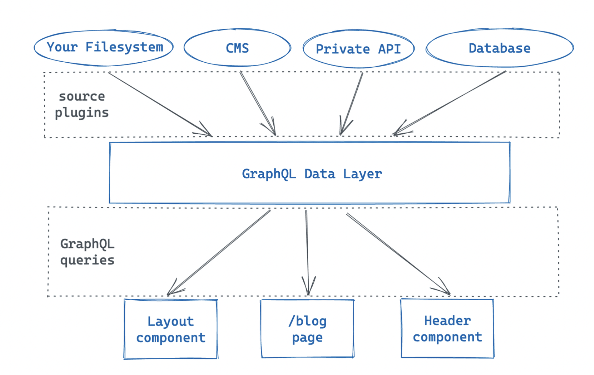

***

개츠비를 사용하면서 GraphQL을 처음으로 사용을 해보았는데 공부한 내용들을 간단하게 정리를 해보려한다.
<br></br>


## GraphQL이란?

GraphQL은 Structed Query Language와 마찬가지로 **쿼리 언어**이며, 2015년 페이스북에서 발표하였다.

쿼리에 대해서 정확하게 설명할 수 있게 생각이 나지 않아 쿼리부터 먼저 다시 검색을 해보았다.
<br></br>

## 쿼리란?

구글에 따르면 우선 query라는 단어 자체가 질문, 문의하다라는 뜻을 가지고 있다. 

프로그래밍 관점에서 생각해본다면, 쿼리란 서버 또는 데이터베이스로부터 원하는 데이터를 얻기 위해 **클라이언트에서 보내는 요청**이라고 생각할 수 있을 것 같다. 

mySQL을 배우면서 쿼리문이라는 것을 작성했던 기억이 나는데, 이것이 데이터베이스에게 내가 원하는 데이터들을 가져오기 위한 요청을 보내는 것이었다.
<br></br>
다시 GraphQL로 돌아가보자.

GraphQL도 mySQL과 마찬가지로 쿼리 언어인데, 그렇다면 두 개의 차이점은 어떤 것인지 궁금했다.
<br></br>
## GraphQL과 mySQL의 차이점

mySQL과 GraphQL 모두 쿼리 언어이긴 하지만 두 개의 언어적 구조 차이는 매우 크며, 실전에서 쓰이는 방식 또한 매우 다르다고 한다.

가장 큰 차이점이라고 할 수 있는 것은 <u>**데이터를 요청보내는 곳이 다르다는 것이다.**</u>

mySQL은 백엔드 시스템에서 작성되어서 데이터베이스로부터 데이터를 효율적으로 가져오기 위해 사용이 된다.

반면, GraphQL은 클라이언트 시스템에서 작성되어서 서버로부터 데이터를 효율적으로 가져오기 위해 사용된다.


서버로부터 데이터를 가져온다고 하는데, 그렇다면 Gatsby에서는 GraphQL이 어떤 식으로 사용이 될까?
<br></br>
## Gatsby에서의 GraphQL

Gatsby에서는 **data layer**라고 하는 사이트 어디에서든지 데이터를 요청 받아올 수 있는 강력한 기능을 제공한다.


<br></br>
개츠비로 만든 사이트가 빌드되기 전, 프로젝트 내의 모든 데이터들이 저장된다. 사진에서 보는바와 같이 Filesystem, CMS, Private API 그리고 Database 안의 데이터들이 개츠비에서 제공하는 GraphQL Data Layer에 저장이 된다.

저장되져있는 데이터들을 사용하고 싶을 땐, 데이터가 필요한 컴포넌트 내부에서 Query문을 작성하여 요청을 보낼 수 있다.
<br></br>

## GraphQL에서 데이터들을 필터하는 방법

Page를 구성하는 컴포넌트 안에서 중복되는 코드들이 많았다. 불필요하다고 생각이 들어 재사용 가능한 컴포넌트를 만들기로 결정을 했었다. 재사용 가능한 컴포넌트에 필요한 props로 아래 세 가지가 필요했다. 

```javascript
1. 카테고리 이름 ex) gatsby
2. 카테고리 설명 ex) gatsby를 활용하여 블로그 작성...
3. 카테고리 내 작성된 글 목록
```
1, 2번은 직접 작성해도 됐지만, 3번이 문제였다. 
간단한 query문을 사용하여 페이지의 title 데이터를 가져오는 것은 쉽게 가능했지만, 마크다운으로 작성되어져있는 파일들 중 내가 원하는 카테고리의 글 데이터들을 가져오는 것은 다른 일이었다. 뭐 그래도 공식 문서에 찾아보면 나올 것이라 생각하여 검색을 해보았더니 역시 금방 찾을 수 있었다.

개츠비에서 제공하는 **GraphiQL interface** 를 사용하여 원하는 마크다운 관련된 데이터들만을 필터하였다. 추가적으로 필터 관련된 글에서 정규표현식과 같은 로직으로 실행되는 **regex** 를 사용하여 필터를 하였더니, 원하는 카테고리의 글 목록들만 얻을 수 있었다.


```javascript
const data = useStaticQuery(graphql`
    {
      allMarkdownRemark(
        filter: { frontmatter: { slug: { regex: "/javascript/" } } }
      ) {
        nodes {
          id
          frontmatter {
            title
            date
            slug
            description
          }
          html
        }
      }
    }
  `)
```
<br></br>
# 마치며

이때까지 항상 개발을 해오면서 서버단에서 쿼리문을 작성하여 데이터를 요청했었는데, 클라이언트쪽에서 작성을 하니 조금 신선했었던 것 같다. 이번 프로젝트에 그렇게 많은 GraphQL 지식이 요구되지는 않아서 깊게 공부하지는 않았는데, 나중에 다시 사용해야될 때가 온다면 공부를 다시 해보고싶다.
<br></br>

***
## Reference

[Query Filters with GraphQL in Gatsby](https://www.gatsbyjs.com/docs/query-filters/)

[Part 4: Query for Data with GraphQL](https://www.gatsbyjs.com/docs/tutorial/part-4/)
<br></br>


